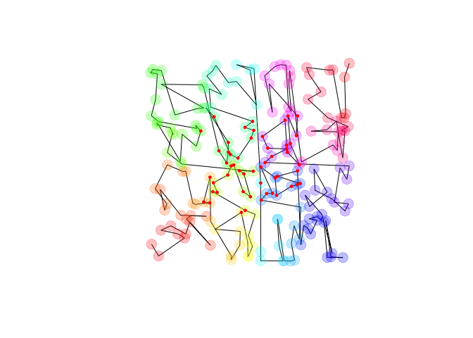

<!-- README.md is generated from README.Rmd. Please edit that file -->

# kdtools

The kdtools package exports a C++ header implementing sorting and
searching on ranges of tuple-like objects without using trees. **Note
that searching and sorting are supported on mixed-types.** It is based
on a kd-tree-like recursive sorting algorithm. Once sorted, one can
perform a range- or nearest-neighbor- query. More details are
[here](https://thk686.github.io/kdtools/). Methods and benchmarks are
[here](https://thk686.github.io/kdtools/articles/methods.html).

``` r
library(kdtools)
x = kd_sort(matrix(runif(400), 200))
plot(x, type  = 'l', asp = 1, axes = FALSE, xlab = NA, ylab = NA)
points(x, pch = 19, col = rainbow(200, alpha = 0.25), cex = 2)
y = kd_range_query(x, c(1/4, 1/4), c(3/4, 3/4))
points(y, pch = 19, cex = 0.5, col = "red")
```



## Native Data Frame Support

The core C++ header implements sorting and searching on vectors of
tuples with the number of dimensions determined at compile time. I have
generalized the package code to work on an arbitrary data frame (or any
list of equal-length vectors). This sorting and search works on any
times that are equality-comparable and less-than-comparable in the C++
STL sense.

``` r
df <- kd_sort(data.frame(a = runif(12),
                         b = as.integer(rpois(12, 1)),
                         c = sample(month.name),
                         stringsAsFactors = FALSE))
print(df)
#>            a b         c
#> 12 0.2602803 1      July
#> 2  0.2614031 0      June
#> 10 0.3507947 0     March
#> 6  0.3645971 1  November
#> 11 0.0828512 2   October
#> 5  0.4375274 3 September
#> 3  0.4402135 0     April
#> 1  0.8794032 1    August
#> 4  0.9408559 0   January
#> 8  0.4427723 1  December
#> 9  0.8321377 1  February
#> 7  0.5745768 1       May
lower <- list(0.1, 1L, "August")
upper <- list(0.9, 4L, "September")
i <- kd_rq_indices(df, lower, upper)
print(i)
#> [1]  1  4  8 10 11 12
df[i, ]
#>            a b        c
#> 12 0.2602803 1     July
#> 6  0.3645971 1 November
#> 1  0.8794032 1   August
#> 8  0.4427723 1 December
#> 9  0.8321377 1 February
#> 7  0.5745768 1      May
```

**Note: Switching to C++17 broke CI (I’d be grateful for a pull-request
fixing this as I cannot make heads-nor-tails of the required
configuration). The code builds and checks fine on my systems.**

[](https://cran.r-project.org/package=kdtools)
[](https://travis-ci.org/thk686/kdtools)
[](https://circleci.com/gh/thk686/kdtools)
[](https://ci.appveyor.com/project/thk686/kdtools)
[](https://codecov.io/github/thk686/kdtools?branch=master)
[](https://zenodo.org/badge/latestdoi/125262786)
