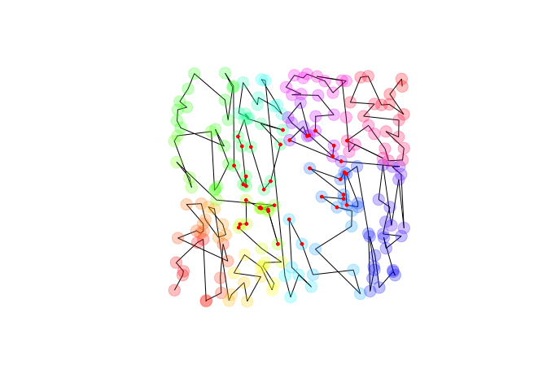

<!-- README.md is generated from README.Rmd. Please edit that file -->
<!-- badges: start -->

[](https://github.com/thk686/kdtools/actions)
[](https://circleci.com/ghr&svg=true)
[](https://codecov.io/github/thk686/kdtools?branch=master)
[](https://zenodo.org/badge/latestdoi/125262786)
[](https://CRAN.R-project.org/package=kdtools)

<!-- badges: end -->

# kdtools

The kdtools package exports a C++ header implementing sorting and
searching on ranges of tuple-like objects without using trees. **Note
that searching and sorting are supported on mixed-types.** It is based
on a kd-tree-like recursive sorting algorithm. Once sorted, one can
perform a range- or nearest-neighbor- query. More details are
[here](https://thk686.github.io/kdtools/). Methods and benchmarks are
[here](https://thk686.github.io/kdtools/articles/methods.html).

``` r
library(kdtools)
x = kd_sort(matrix(runif(400), 200))
plot(x, type  = 'l', asp = 1, axes = FALSE, xlab = NA, ylab = NA)
points(x, pch = 19, col = rainbow(200, alpha = 0.25), cex = 2)
y = kd_range_query(x, c(1/4, 1/4), c(3/4, 3/4))
points(y, pch = 19, cex = 0.5, col = "red")
```



## Native Data Frame Support

The core C++ header implements sorting and searching on vectors of
tuples with the number of dimensions determined at compile time. I have
generalized the package code to work on an arbitrary data frame (or any
list of equal-length vectors). This sorting and search works on any
times that are equality-comparable and less-than-comparable in the C++
STL sense.

``` r
df <- kd_sort(data.frame(a = runif(12),
                         b = as.integer(rpois(12, 1)),
                         c = sample(month.name),
                         stringsAsFactors = FALSE))
print(df)
#>            a b         c
#> 1  0.5153793 0     April
#> 4  0.2560690 0   January
#> 10 0.2799267 0       May
#> 2  0.2487816 1  February
#> 3  0.1202885 1      June
#> 5  0.5248282 1 September
#> 12 0.5363906 1   October
#> 8  0.8257168 0     March
#> 9  0.6949265 0  November
#> 6  0.9496950 0      July
#> 7  0.8305146 2    August
#> 11 0.7698841 3  December
lower <- list(0.1, 1L, "August")
upper <- list(0.9, 4L, "September")
i <- kd_rq_indices(df, lower, upper)
print(i)
#> [1]  4  5  7 11 12
df[i, ]
#>            a b        c
#> 2  0.2487816 1 February
#> 3  0.1202885 1     June
#> 12 0.5363906 1  October
#> 7  0.8305146 2   August
#> 11 0.7698841 3 December
```
